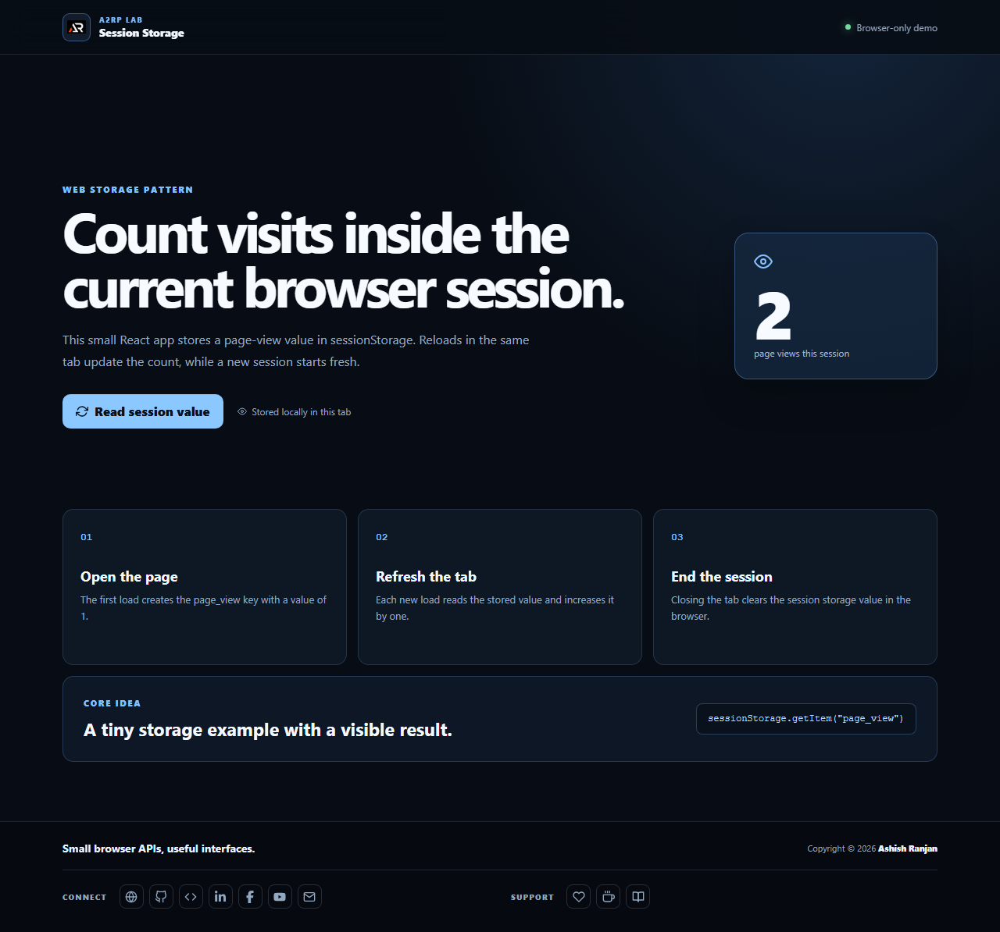

# Session Storage React Demo

A responsive React page-view counter that persists inside the current browser tab with sessionStorage.

## Features

- Creates and increments a `page_view` sessionStorage value
- Displays the current tab session count in a focused dashboard
- Explains the storage lifecycle with a simple responsive interface
- Fixed branded header and icon-only footer links

## Tech stack

React, Create React App, JavaScript, sessionStorage, and react-icons.

## Run locally

```bash
npm install
npm start
```

Build with `npm run build` and deploy with `npm run deploy`.

## Live

[Open the Session Storage React demo](https://a2rp.github.io/session-storage-reactjs/)



## Links

- [Portfolio](https://www.ashishranjan.net/)
- [GitHub](https://github.com/a2rp)
- [CodePen](https://codepen.io/ash1198)
- [LinkedIn](https://www.linkedin.com/in/aashishranjan)
- [Facebook](https://www.facebook.com/theash.ashish/)
- [YouTube](https://www.youtube.com/@ashishranjan-ashz?sub_confirmation=1)
- [Email](mailto:ash.ranjan09@gmail.com)

## Support

- [Support](https://a2rp-donation-page.netlify.app/)
- [Buy Me a Coffee](https://buymeacoffee.com/a2rp)
- [Patreon](https://patreon.com/a2rp)
